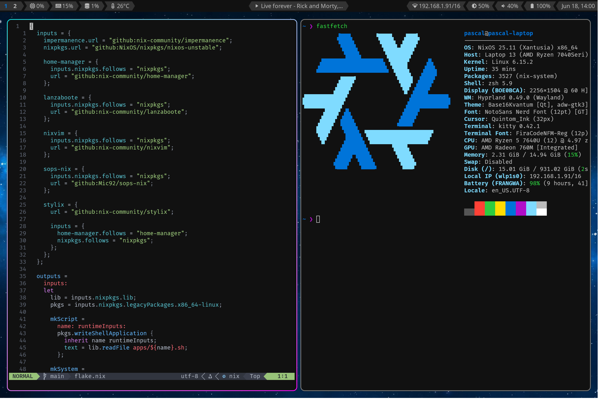

# My NixOS Configuration

NixOS is a fully declarative Linux distribution - and this repository contains the files required to make _my version_ of NixOS.

> [!IMPORTANT]
> This is _my_ configuration, containing _my_ secrets and requiring _my_ password to install.
> You are more than welcome to take inspiration from this project, but installing as is probably won't work for you.

## Inputs

- [Home Manager](https://github.com/nix-community/home-manager) - they say not to let them in your home
- [Impermanence](https://github.com/nix-community/impermanence) - `rm -rf --no-preserve-root /`
- [Lanzaboote](https://github.com/nix-community/lanzaboote) - an island of security in an ocean of unknown hardware
- [Nixpkgs (unstable)](https://github.com/NixOS/nixpkgs/tree/nixos-unstable) - all your packages are belong to us
- [Nixvim](https://github.com/nix-community/nixvim) - who needs lua when you have nix
- [SOPS Nix](https://github.com/Mic92/sops-nix) - they built a wall around infinity, separated all the infinite values from all the infinite values nobody should know
- [Stylix](https://github.com/danth/stylix) - one tool to style them all, one file to declare them, one command to apply them all and in dark themes reside

## Components

| Component           | Desktop                      | Server              |
| ------------------- | ---------------------------- | ------------------- |
| Boot loader         | Lanzaboote                   | systemd-boot / GRUB |
| Filesystem          | btrfs + LUKS                 | btrfs               |
| Networking          | NetworkManager + resolved    | systemd-networkd    |
| Shell               | ZSH                          | ZSH                 |
| Editor              | neovim                       | vim                 |
| Window manager      | Hyprland                     |                     |
| Audio server        | pipewire                     |                     |
| Terminal emulator   | kitty                        |                     |
| File manager        | Dolphin                      |                     |
| Browser             | Firefox                      |                     |
| Bar                 | waybar                       |                     |
| Launcher            | rofi                         |                     |
| Notification daemon | mako                         |                     |
| Theme               | base16-colors / onedark.nvim |                     |
| Font                | Noto / FiraCode (Nerd Fonts) |                     |

## Structure

- [flake.nix](flake.nix): Entry point
- [lib.nix](lib.nix): Helper functions
- [machines.json](machines.json): List of machines
- [apps](apps/): Scripts exported by flake
- [base](base/): Shared configuration
- [extra](extra/): Additional modules
- [machines](machines/): Machine-specific configuration
- [modules](modules/): Custom options
- [overlay](overlay/): Custom packages and overrides
- [resources](resources/): Resources and non-nix configuration files
  - [wallpaper.jpg](resources/wallpaper.jpg): Background image ([source](https://wallpaperscraft.com/wallpaper/starry_sky_night_dark_152039))
  - [extensions](resources/extensions/): Custom extension lock files
  - [scripts](resources/scripts/): Shell scripts
  - [secrets](resources/secrets/): SOPS stores

## Why?

Here are _my_ reasons, why I think NixOS is awesome:

1. **NixOS is like dotfiles, only on steroids.** As soon as you use more than one device, like a desktop computer at home and a laptop on the go, a non-negligible amount of your sadly very finite time is going to be used to synchronize data and configurations between your devices. Most people use a dotfiles repository to combat this, and NixOS is just an incredibly powerful dotfiles manager.
2. **NixOS is declarative.** I know, this is like the main selling point of NixOS, but having all your system configuration in a single place makes it easy to read through and know what you've changed.
3. **The NixOS ecosystem.** This mainly refers to the [impermanence](https://github.com/nix-community/impermanence) module that allows you to keep your system clean between reboots. This is not directly a feature of NixOS, but is made possible by its unique way of handling packages and system configurations.
4. **A NixOS system is up and running in no time.** Using NixOS you don't have to worry about broken installs. Just reinstall the system and your entire configuration is already there.
5. **The Nixpkgs repository.** According to [repology](https://repology.org/repositories/graphs), the nixpkgs repository is by far the largest and most up-to-date Linux package repository. And their way of handling packages makes it incredibly easy to add custom packages or patches for existing ones.

That being said, NixOS is definitely not the solution for everyone.
It has a steep learning curve and requires the use of a full-blown programming language to configure.
Before trying NixOS, I would definitely recommend you have a solid understanding of the Linux ecosystem and (declarative) programming languages.
